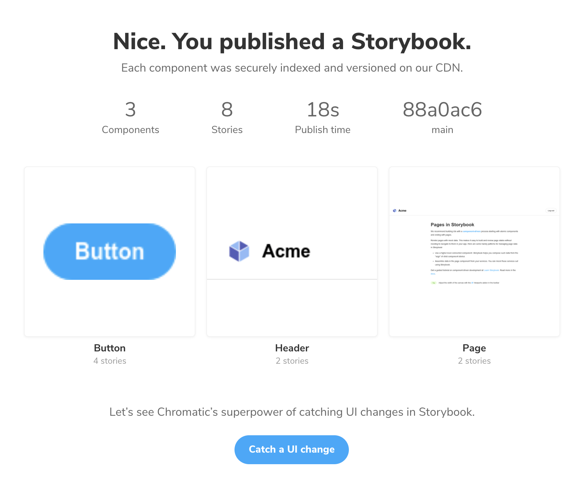

## Storybook how to

### Step 1. create react app with [create-react-app](https://create-react-app.dev/docs/adding-typescript/)

```shell
npx create-react-app your-app-name

# or if, typescript.

npx create-react-app your-app-name --template typescript
```


### Step 2. [add storybook](https://storybook.js.org/docs/react/get-started/install)

init storybook with `sb init` on existing project.

```shell
npx sb init
```

> by running above command, storybook will create new directory called `.storybook` with boilerplate components. 

then, run it for testing.

```shell
yarn run storybook
```

your storybook will be available on http://localhost:6006/


Step 3. add example component.


### Step 4. run it, publish it.

publising on chromatic.

* signup / signin to chromatic
* create new project
* `yarn add --dev chromatic` to your react app
* `yarn chromatic --project-token=pXXXXXX` which XXXXX should be your own token from chromatic

```
⚠ No 'chromatic' script found in your package.json
Would you like me to add it for you? [y/N] y

✔ Added script 'chromatic' to package.json
You can now run it here or in CI with 'npm run chromatic' or 'yarn chromatic'.

ℹ Your project token was added to the script via the --project-token flag.
If you're running Chromatic via continuous integration, we recommend setting
the CHROMATIC_PROJECT_TOKEN environment variable in your CI environment.
You can then remove the --project-token from your package.json script.

✨  Done in 80.94s.
```

> after this is complete, remove token if possible from `"chromatic": "npx chromatic --project-token pXXXXX"`


your console screen from cromatic.com will be updated as so.




### Step 5 re-run, view diff, collaborate, accept changes

you can re-run the `yarn chromatic --project-token=pXXXXXX` command, it will re publish with diff detection.

supports text style, size, color, and more..


## Available Scripts

> This project was bootstrapped with [Create React App](https://github.com/facebook/create-react-app).

In the project directory, you can run:

### `yarn start`

Runs the app in the development mode.<br />
Open [http://localhost:3000](http://localhost:3000) to view it in the browser.

The page will reload if you make edits.<br />
You will also see any lint errors in the console.

## Learn More

You can learn more in the [Create React App documentation](https://facebook.github.io/create-react-app/docs/getting-started).

To learn React, check out the [React documentation](https://reactjs.org/).
